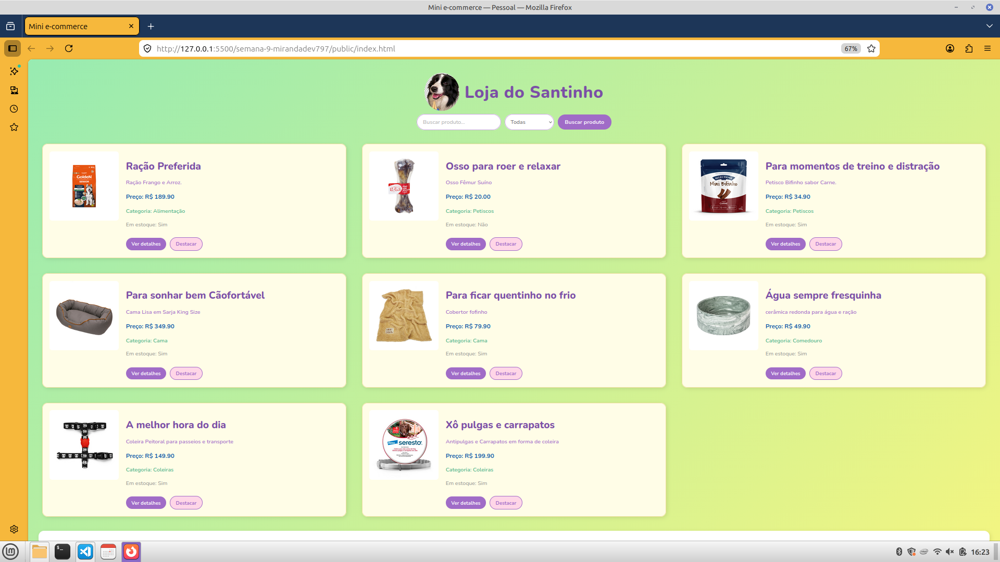
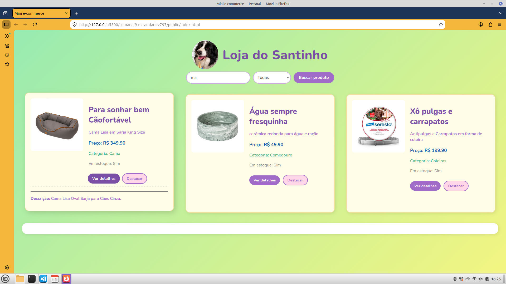
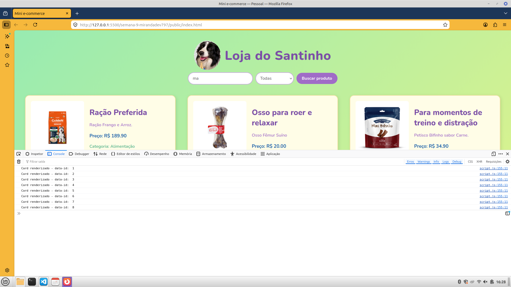

# Trabalho Prático - Semana 9

Nesta atividade, será desenvolvido um programa para praticar o uso de funções em JavaScript e a manipulação do DOM. O objetivo é criar uma tela simples no estilo e-commerce, com a listagem de produtos em cards a partir de um objeto JSON (array de produtos).

## Informações Gerais

- Nome: Marina Miranda Nunes
- Matrícula: 968137

## Prints do trabalho

<<  COLOQUE A IMAGEM - TELA DE CARDS DE PRODUTOS - AQUI >>

<<  COLOQUE A IMAGEM - TELA DE DETALHE DO PRODUTO - AQUI >>

<<  COLOQUE A IMAGEM - TELA DO CONSOLE - AQUI >>

